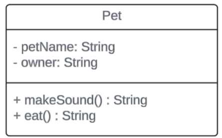
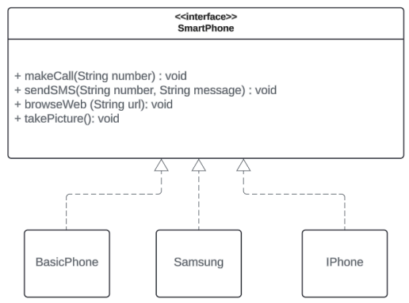

# LabSW4_SolidPrinciples

1. The following object violates Single Responsibility Principle (SRP). 
Make the adjustment
in a form of java code to correct the violation. (25 points)

2. The following code violates the Open/Close Principle. 
Refactor the program to remove
the violation (25 points).

public class Customer {
private String name;
private String type; // "Student", "Senior Citizen", or "Regular"
public Customer(String name, String type) {
this.name = name;
this.type = type;
}
public double calculateDiscount(double amount) {
if (type.equalsIgnoreCase("Student")) {
return amount * 0.05;
} else if (type.equalsIgnoreCase("Senior Citizen")) {
return amount * 0.10;
} else {
return 0.0; // No discount for Regular
}
}
public double applyDiscount(double amount) {
return amount - calculateDiscount(amount);
}
}

3. The following design has the following problem:
● The SmartPhone interface defines methods for making calls, sending SMS,
browsing the web, and taking pictures.
● While smartphones (Iphone and Samsung) can utilize all functionalities, a
basic phone (BasicPhone) only needs calling and SMS capabilities.
● Forcing the BasicPhone class to implement unused methods (browseWeb and
takePicture) violates ISP.

Show your solution in codes how to remove the Interface Segregation problem.

4. Refactor the following codes applying the Dependency Inversion Principle (25 points):

public class PaymentProcessor {
 public void processPayment(Order order) {
 String paymentMethod = order.getPaymentMethod();
 if (paymentMethod.equals("ewallet")) {
 EWallet ewallet = new EWallet();
 ewallet.pay(order.getAmount());
 System.out.println ("You are paying in GCash")
 } else if (paymentMethod.equals("cash")) {
 System.out.println ("You are paying in Cash").
 } else if (paymentMethod.equals("creditcard")) {
 CreditCard creditCard = new CreditCard();
 creditCard.charge(order.getAmount());
 System.out.println ("You are paying using Credit Card")
 } else {
 throw new IllegalArgumentException("Unsupported payment method: " +
paymentMethod);
 }
 }
}
Naming Conventions:
1. Class name must be a NOUN (singular)
2. Class names must start with capital letters.
3. Attribute name and method name should start with a small letter.
4. Method name should be a verb.
